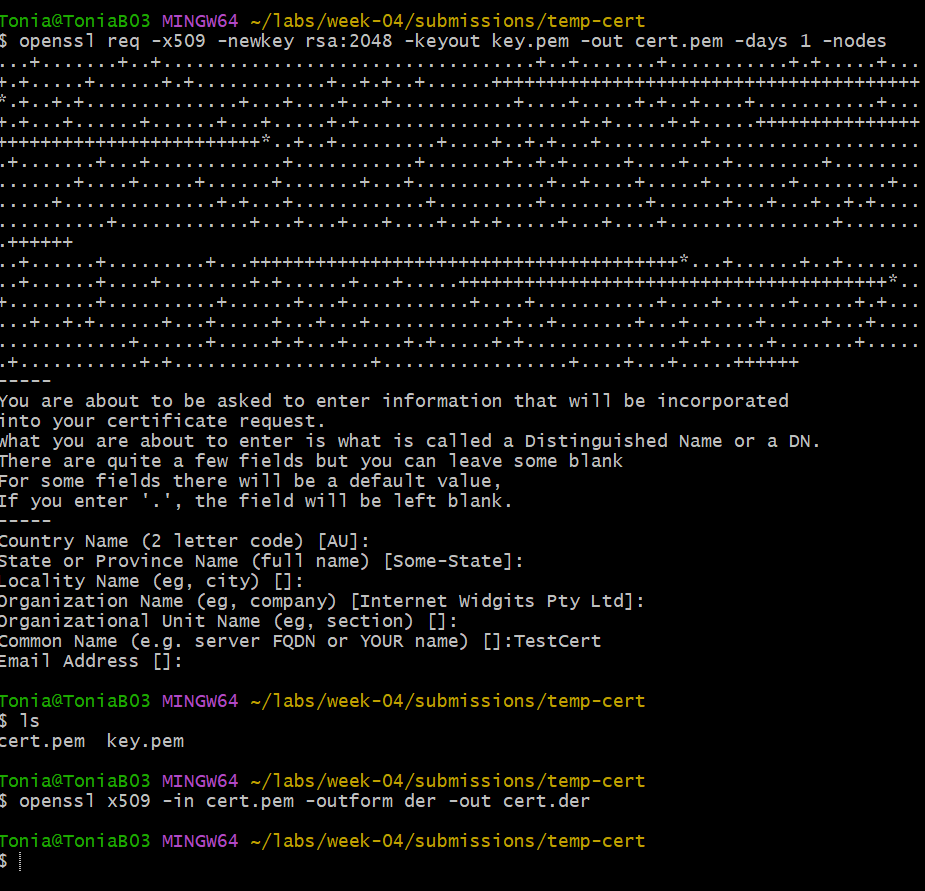

#1 Lab — Convert Certificate Formats

## Overview
Briefly describe the purpose of this lab in your own words.

The purpose of this lab is to understand how different certificate formats work and how to convert between them using OpenSSL. I used commands to investigating how certificates can be represented in PEM, DER, and PFX formats and how each format is used in PKI systems. This lab also helped me understand how certificate data stays the same even when the format changes, and how certificates and private keys can be bundled together securely.

What PKI concept or system behavior were you investigating?
I was investigating how certificate formats work within PKI and how they can be converted between PEM, DER, and PFX without changing the actual certificate data. I also explored how certificates and private keys are handled together, especially when creating a PFX bundle. This helped me understand how PKI systems manage certificate storage, coding, and secure data transitt in real-world environments.

## Steps Performed

1. First, I retrieved a live certificate, worked with PEM and DER formats, and converted between them using OpenSSL. 
2. Next, I verified that the certificate data remained intact after conversion. I also generated a key pair, created a self-signed certificate, and bundled them into a password-protected PFX file. 
3. Last, I made sure not to expose the private key by excluding it from committing it from my repo. 

---

## Results

The OpenSSL commands successfully retrieved and displayed the certificate details, including  (google.com), issuer (Google Trust Services), validity dates, and public key information. The PEM certificate was readable and showed the BEGIN and END markers, while the DER version appeared unreadable in a text editor but was successfully parsed using OpenSSL. The conversion from PEM to DER and back to PEM was verified using the diff command, which showed no differences, confirming the certificate data remained unchanged. Finally, the PFX bundle was created and verified, confirming it contained both the certificate and private key and required a password for verification.

## Key Findings

-The certificate retrieved from the website contained important fields such as the subject, issuer, validity period, and public key, which are all critical for establishing trust in PKI.

-PEM format is human-readable with clear BEGIN and END markers, while DER format is binary and not readable in a text editor, even though both represent the same certificate data.

-Converting the certificate from PEM to DER and back to PEM did not change the certificate, which was confirmed using the diff command showing no differences.

-The PFX bundle successfully combined the certificate and private key into a single file and required a password, demonstrating how sensitive key material is protected.

-An important observation was that private keys must be handled securely and should never be committed, this reinforces the importance of confientiality to avoid compromise. 

## Explanation

The results matter because they show that certificate data remain the same, even when converted between different formats like PEM and DER, which is critical for crossing between systems. The validation of the certificate and the diff results confirmed that encoding changes do not affect integrity of the certificate. Creating and verifying the PFX bundle shows how certificates and private keys are secured and stored together, which is important for deploying certificates. This connects to the week’s learning outcomes by showing how certificate formats, trust, and secure handling of keys all work together in PKI systems to support secure communication and authentication.

## Challenges / Troubleshooting

During the lab, I experienced several command and file path issues, especially when working in Git Bash. First, ere was an issue with files that were not found. This error occured becasuse I was in the wrong directory, which caused confusion when trying to save and locate files. I also experienced errors when running OpenSSL commands due to formatting issues, particularly with the -subj parameter, which was resolved by running the command on a single line. Another challenge was with Git Dektop and ensuring that my commits were connecting to the correct folders. These issues helped me better understand file structure, command lines, and how to troubleshoot issues with GIT.

## Artifacts
List the files generated or submitted during this lab.
leaf_cert.pem — Retrieved certificate in PEM format
leaf_cert.der — Certificate converted to DER format
leaf_cert_restored.pem — PEM certificate restored from DER
test_cert.pem — Self-signed test certificate
test_bundle.pfx — PFX bundle containing certificate and private key
lab-01-convert-certificate-formats.md — Completed lab write-up

(test_key.pem was generated but excluded from the repository using .gitignore to protect the private key.

*CVI PKI Career Pathway — Foundations Phase*
