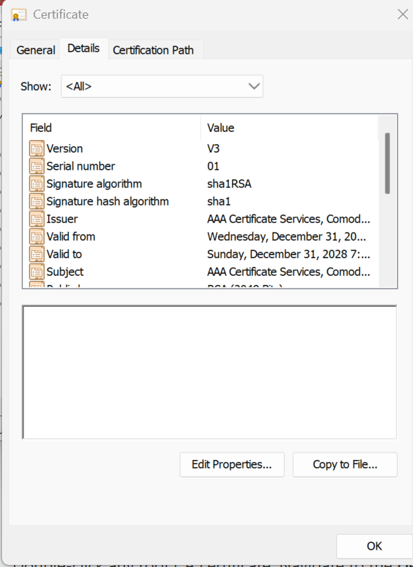
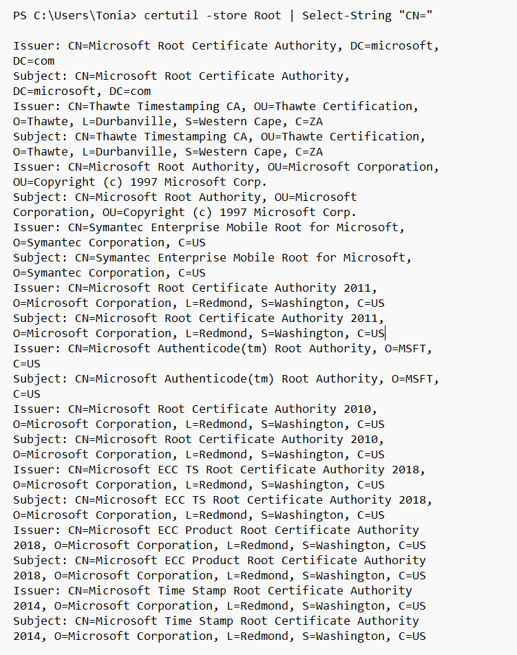

# Lab 02 — Inspect Trust Stores
## Overview
The purpose of this lab was to understand how my operating system manages trusted root certificates and how that trust store is used during certificate validation. I explored where trusted Certificate Authorities are stored, how to inspect them, and how they relate to real-world secure connections. This lab focused on how trust is established in PKI and how systems decide whether to trust a certificate. My fininding were based of the use of my windows opertaing sytem.

---

## Steps Performed

1. First, I navigated to my GitHub repository and created the artifact directory for the lab.
2. Second, I opened the Windows Certificate Manager using certmgr.msc and located the Trusted Root Certification Authorities store.
3. Next, I reviewed the list of trusted root CAs and counted the total number of certificates.
4. Then, I selected a root certificate and inspected its details such as subject, issuer, validity period, and public key algorithm.
5. I used PowerShell to run certutil -store Root | Select-String "CN=" to view the list of trusted root CA names.
6. Finally, I used OpenSSL to connect to google.com and validate its certificate against my system trust store.

---

## Results

The windows system trust store contained 39 trusted root Certificate Authorities.
Example root CA details:
Subject: AAA Certificate Services, Comodo CA Limited
Issuer: AAA Certificate Services, Comodo CA Limited 
Valid From/Valid to: Wednesday, December 31, 2003 8:00:00 PM
Sunday, December 31, 2028 7:59:59 PM
Public key algorithm RSA (2048 Bits)



```

```


## Key Findings
-The trust store contains root certificates that act as trust anchors for certificate validation.

-Root CA certificates are self-signed, meaning the subject and issuer are the same.

-Certificate validation depends on building a chain from the server certificate back to a trusted root CA.

-The system automatically trusts certificates that chain to a root CA in the trust store.


## Explanation
These results matter because the trust store is what determines whether a secure connection is allowed or rejected. When a certificate is presented during a TLS connection, the system checks if it can trace the certificate back to a trusted root CA. If that trust chain exists and is valid, the connection is accepted. This is how browsers and operating systems ensure secure communication across the internet.

---

## Challenges / Troubleshooting
One issue I encountered was trying to run certmgr.msc in Git Bash, which resulted in a error because it is a Windows tool. I resolved this by launching it using the Run dialog instead. I also had some confusion with file paths due to OneDrive redirecting my Documents folder, but I was able to locate the correct GitHub repository path and continue the lab.


## Artifacts
- root-certificate-details-week-04.png  
- verification-output-week-04.png  
- lab-02-inspect-trust-stores.md 

lab-02-inspect-trust-stores.md


*CVI PKI Career Pathway — Foundations Phase*
