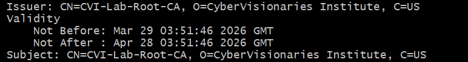

# Lab — lab-03-install-and-validate


## Overview
Briefly describe the purpose of this lab in your own words.
This lab focused on understanding how trust works in PKI by creating and installing my own root Certificate Authority (CA), then using it to sign and validate another certificate. I explored how systems decide whether a certificate is trusted and what happens when that trust is removed.
The main PKI system concept I investigated was the trust chain, specifically how a self-signed root CA can be used to establish trust for other certificates and how that trust is enforced by operating system. In this case, my OS was windows.


## Steps Performed

1. First, I generated a private key and created a self-signed root CA certificate using OpenSSL, defining the subject details directly in the command. In this case, the    subject was "/CN=CVI-Lab-Root-CA/O=CyberVisionaries Institute/C=US".
2. Next, I installed the root CA into my Windows trust store using PowerShell (running as Administrator) so the system would recognize it as a trusted authority.
3. Then, I created a second private key and generated a Certificate Signing R request (CSR) for a test certificate.
4. Last, the certificate was signed using my root CA simulating how certificates are issued in real-time. 

## Results
Include the important outputs or findings from the lab.

The root CA certificate showed the same Subject and Issuer, confirming it was self-signed.

The signed certificate successfully validated using OpenSSL:

test-signed.crt: OK

This confirmed the certificate chain was trusted when the root CA was present.

After removing the root CA from the trust store, the system no longer trusted certificates issued by it, demonstrating how trust is dependent on the root CA being installed.


```

```

```

## Key Findings
Document the most important observations from the lab.

-I observed that the root CA certificate had the same Subject and Issuer, confirming it was self-signed and acting as the trust anchor.

-The signed certificate successfully validated (OK) when using the root CA, showing that the trust chain was working correctly.
After removing the root CA from the trust store, the system no longer trusted the signed certificate, even though the certificate itself had not changed.

-I also noticed that trust is not based on the certificate alone, but on whether the issuing CA exists in the system’s trusted store.


## Explanation

These results matter because they demonstarte how PKI trust is established and enforced. A certificate is only considered valid if it connects back to a trusted root CA, which is why the validation succeeded when the root CA was installed.

When the root CA was removed, validation failed because the system no longer had a trusted authority to verify the certificate’s signature. This reflects how browsers and operating systems work in TLS —which  relies on trusted root stores to determine if the  certificate should be accepted or rejected.

This lab connects directly to the concept of chain of trust, showing that trust is not inherent to a certificate, but inherited from a trusted root authority.

## Challenges / Troubleshooting

I initially encountered a permission denied error when trying to install the certificate into the Windows trust store. I resolved this by reopening PowerShell as Administrator.

I ran into formatting issues with the openssl req command due to path handling in Git Bash.

I also had some confusion with file paths and nested repository folders, which caused files to appear missing. I resolved this by confirming the correct directory using pwd and git rev-parse --show-toplevel.

---

## Artifacts

test-root-ca.crt — self-signed root CA certificate
test-signed.csr — certificate signing request
lab-03-install-and-validate.md
Screenshots stored in `assets/screenshots/`

---

*CVI PKI Career Pathway — Foundations Phase*
