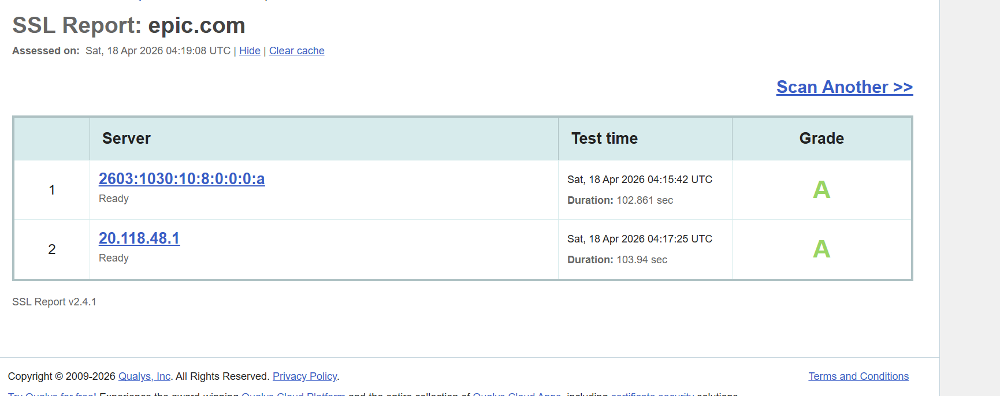
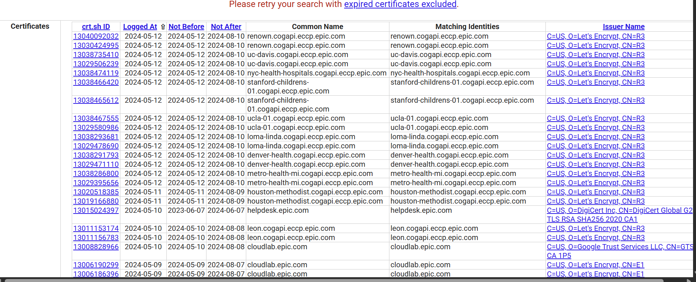

lab-01-enterprise-certificate-analysis

**Target**

The hostname analyzed was epic.com. I chose this domain because Epic is a major enterprise healthcare software provider, making it a strong real-world example of how PKI is implemented in a high-security, regulated environment where trust, availability, and compliance are critical.

**Certificate Summary****
Issuer: GeoTrust TLS RSA CA G1 (DigiCert)
Validity Window: 6 months (Feb 2026 – Aug 2026)
Certificate Type: Domain Validation (DV)
SAN Count: 1
Wildcard Usage: None

**Chain Analysis**
Number of Certificates in Chain: 2
Intermediate CA: GeoTrust TLS RSA CA G1
Root CA: DigiCert Global Root G2 (implicitly trusted)
Chain Completeness: Complete

The server presents both the leaf and intermediate certificates. The root CA is not included, as it is already trusted by the client’s trust store.

**Termination Analysis**

TLS does not appear to terminate at the application server. Although the HTTP response indicates Server: Kestrel, this alone does not confirm termination at the application layer.
Based on standard enterprise architecture patterns, it is most likely that TLS terminates at a load balancer or reverse proxy.

**TLS Configuration**
SSL Labs Grade: A
TLS Versions Supported: TLS 1.2, TLS 1.3
Deprecated TLS Versions: Not supported
HSTS: Enabled
OCSP Stapling: Enabled

The configuration reflects modern best practices

**CT Log Analysis**

Certificate Transparency logs show a large volume of certificates issued for epic.com and its subdomains, indicating a broad certificate footprint.

CA Consistency: Not uniform
DigiCert / GeoTrust used for primary domains
Let’s Encrypt used extensively for subdomains
Google Trust Services observed in some cases
Unexpected Issuers: None identified
Validity Pattern:
6 months (DigiCert-issued certificates)
90 days (Let’s Encrypt-issued certificates)

This suggests a mix of traditional enterprise PKI and automated certificate management.

**Architecture Assessment**

Epic’s certificate deployment reflects a distributed PKI architecture where different certificate authorities are used across services and environments. This structure indicates a balance between trust and scapability.

## Overview
The purpose of this lab was to analyze how Public Key Infrastructure (PKI) is implemented in a real-world environment by examining the TLS configuration and certificate of a live enterprise domain (epic.com).I selected epic.com because Epic is a major enterprise healthcare software provider. Their platform supports hospitals and large-scale clinical systems, making their TLS deployment a strong example of how PKI is implemented in a high-security, regulated environment.

This lab focused on understanding:

How certificates are issued and validated in production
How trust is established through certificate chains
How Certificate Transparency (CT) logs show an organization’s certificate footprint
How enterprise PKI strategies vary across services and environments

---

## Steps Performed

1. Used openssl s_client to connect to epic.com:443 and retrieve the live TLS certificate.
2. Extracted and saved the leaf certificate as epic_cert.pem.
3. Parsed the certificate using openssl x509 -text to review:Subject and Issuer Validity period Key usage and extensions
4. Verified the certificate chain using openssl verify.
5. Analyzed TLS protocol  using: openssl s_client output and SSL Labs report
6. Queried Certificate Transparency logs using crt.sh to determine: Historical certificate issuance, Issuer patterns,
Domain and subdomain coverage

## Results
**Certificate Details**
Subject: CN=epic.com
Issuer: DigiCert / GeoTrust intermediate
Validity Period: ~6 months
Public Key: RSA (2048-bit)
Signature Algorithm: SHA-256

**TLS Configuration**
Protocol: TLS 1.2 and TLS 1.3 supported
Cipher Suites: Strong modern ciphers
SSL Labs Grade: A+

**Certificate Details**
Subject: CN=epic.com
Issuer: DigiCert / GeoTrust intermediate
Validity Period: ~6 months
Public Key: RSA (2048-bit)
Signature Algorithm: SHA-256

**Chain Validation**
The certificate chain successfully validated to a trusted root CA
No missing intermediates were observed
No errors were returned during verification

**Certificate Transparency Findings**
A large number of certificates were issued for epic.com and its subdomains

**Subdomains include:**
www.epic.com
media.epic.com
link.epic.com
*.cogapi.eccp.epic.com

**Multiple Certificate Authorities observed:**
DigiCert / GeoTrust
Let’s Encrypt
Google Trust Services

**Validity patterns:**
6 months (DigiCert-issued certificates)
90 days (Let’s Encrypt-issued certificates)
6 months (DigiCert-issued certificates)
90 days (Let’s Encrypt-issued certificates)
The certificate chain successfully validated to a trusted root CA
No missing intermediates were observed
No errors were returned during verification

The SSL Labs scan confirms that epic.com is configured with a strong TLS posture, receiving an A grade and supporting modern protocols and cipher suites.

The CT log results show a large number of certificates issued for epic.com and its subdomains, along with multiple certificate authorities indicating a distributed PKI model.

## Key Findings
-Epic uses multiple certificate authorities
-Epic doamin rely on traditional enterprise CAs (DigiCert/GeoTrust).
-Certificates are actively managed across environments.
-TLS configuration is strong and aligned with modern security standards.
-No misconfigurations or trust failures were observed.

## Explanation
This lab demonstrates how PKI operates in a real enterprise environment.

This lab also shows that large enterprises do not  relying on a single certificate authority, Epic uses a hybrid PKI model:
Enterprise-managed certificates for primary domains Automated certificates (Let’s Encrypt) for scalable services and APIs

This approach supports:

Scalability-automated issuance for ddynamic environments
Security-short-lived certificates reduce risk 
Operational flexibility-different teams or platforms can manage certificates independently

Certificate Transparency logs provide visibility into this architecture by exposing:
Certificate issuance patterns-Subdomain expansion-CA usage across environments

This reinforces that PKI is not just about encryption it is about managing trust at scale across systems.

Challenges / Troubleshooting
The CT log results returned a very large dataset, making it impractical to count certificates manually.
Command errors related to comitting the pem.file

## Artifacts
epic_cert.pem 
OpenSSL command outputs
SSL Labs report screenshot
crt.sh query results screenshots

This lab helped bridge the gap between PKI theory and real-world implementation.

It showed that enterprise PKI is not central or uniformd — it is distributed, automated, and integrated into infrastructure. The presence of multiple certificate authorities, short-lived certificates, and a large certificate footprint reflects how modern organizations manage trust across web services, APIs, and cloud environments.

---

*CVI PKI Career Pathway — Foundations Phase*
